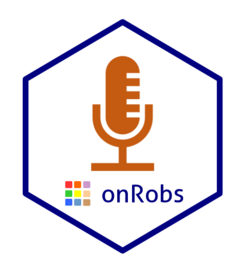

<!-- README.md is generated from README.Rmd. Please edit that file -->

<a href="https://franklentz.github.io/onRobs/"></a>

# onRobs

<!-- badges: start -->
<!-- badges: end -->

This package enables you to control OBS through the OBS Websockets
Server. Its strongly rely on the *websocket* package.

## Installation

You can install the development version of onRobs from
[GitHub](https://github.com/) with:

``` r
# install.packages("devtools")
devtools::install_github("franklentz/onRobs")
```

### OBS Websocket Server in OBS

OBS must be running (the package has been tested with version 29) and
you need to start the websockets server. You will find the websocket
server in Tools \> Websockets server Settings Make sure

### Connection and Identification

There are three steps to start interacting with OBS Webserver once it is
running

- Create an OBSWebsocket (this is the object you will use to interact
  with OBS through the websockets server
- Establish a connection with the server
- Identify and authenticate. If authentication has been activated on the
  OBS Websockets server, you will need to supply the password

<!-- -->

    library(onRobs)
    myobs <- createOBSWebsocket() 
    connectToOBS(obs = myobs)
    identifyToOBS(obs = myobs, eventSub = "33", password = "myObsWebsocketsServerPassword")
